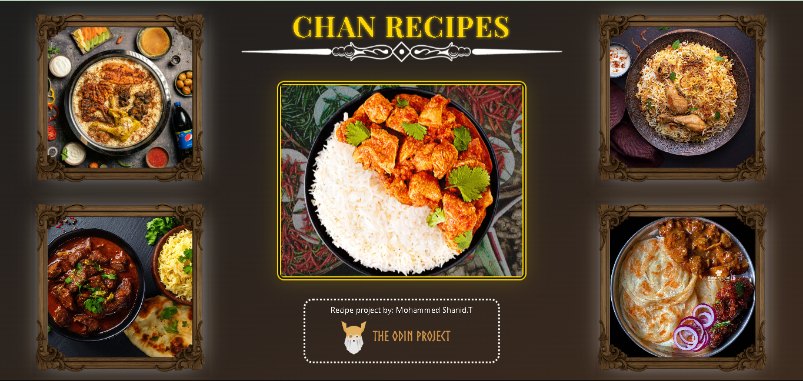
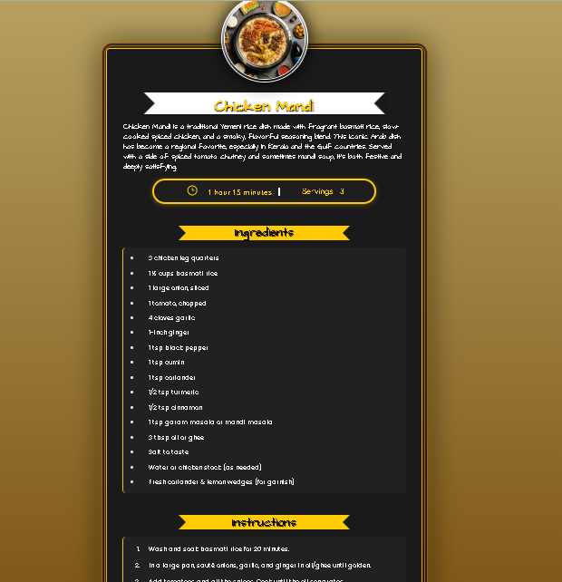

# 🍽️ Chan Recipes

A simple, clean multi-page recipe website built as part of **[The Odin Project](https://www.theodinproject.com/)** curriculum.  
Originally started with basic HTML and CSS, this project was later redesigned with a modern UI and enhanced using JavaScript for dynamic recipe rendering and subtle animations to improve user experience.

---

## 📅 Project Timeline

- **First Created:** January 28, 2025  
- **Redesigned:** June 19, 2025  

---

## 🔗 Live Site

- 🌐 [Live Website](https://mohammedshanid8428.github.io/Chan-recipes/)  
- 📂 [GitHub Repository](https://github.com/mohammedShanid8428/Chan-recipes)

---

## 📖 Project Overview

This project began as a basic static HTML site featuring a homepage and three individual recipe pages.  
After 10 months, it was completely redesigned into a modern, responsive experience with dynamic functionality and animations for smooth visual transitions.

### ✅ Highlights

- Responsive modern layout across devices  
- Recipe cards with images on the homepage  
- Dynamic recipe rendering using JavaScript  
- URL parameters to load selected recipe content  
- Clean DOM manipulation using `querySelector`, `dataset`  
- ✨ **Animations** for interactive feedback and smooth transitions (e.g., card hover, page fade-in effects)

---

## 🛠️ Built With

- **HTML5**  
- **CSS3** (including transitions & keyframe animations)  
- **JavaScript (ES6+)**

---

## 🧠 Key Concepts Learned

- Structuring multi-page static websites  
- Writing semantic HTML and clean, scalable CSS  
- Creating dynamic pages with JavaScript  
- Using and parsing URL parameters  
- DOM manipulation with `querySelector`, `dataset`, and `innerHTML`  
- Adding animations using CSS transitions and keyframes

---

## 📸 Screenshots

| New Homepage | New Recipe Page |
|--------------|-----------------|
|  |  |

---

## 🚀 Future Improvements

- [ ] Make the site fully responsive across all screen sizes  
- [ ] Store recipe data in a separate JSON file for scalability  
- [ ] Add search and filter functionality  
- [ ] Allow users to favorite or bookmark recipes  
- [ ] Improve accessibility (color contrast, ARIA attributes, keyboard navigation)  
- [ ] Add loading animations for recipe transitions

---

## 🎞️ Animations Used

To improve user engagement and provide a smoother user experience, multiple CSS animations were integrated throughout the site. These animations are built using custom `@keyframes` and CSS transitions to add subtle motion and interactive feedback.

### 🔧 Key Animations

- **Card Hover Effects:**  
  Recipe cards slightly scale up and cast a soft box-shadow on hover, creating a more tactile feel.

- **Page Load Transitions:**  
  Pages fade in gracefully using the `fadeIn` and `intro` animations.

- **Image Zoom-In on Reveal:**  
  When images come into view, they animate from a smaller scale using the `expand` animation.

- **Slide-In Effects:**  
  Elements slide in from the **left** or **right** using `leftSlide` and `rightSlide` animations.

- **Vertical Motion Animations:**  
  Used for layered content reveals — e.g., titles or overlays sliding **up** or **down** using `Up` and `Down`.

- **Section Entry Animation:**  
  `appear` and `recipeAppear` animate margin and opacity to create smooth entry effects for content blocks.

- **Progress Line Animation:**  
  Section headers and visual separators animate from **0% width** to **70% or 50%** using `extend` and `subExtend`.

> 💡 All animations are implemented using **pure CSS** for performance and browser compatibility. No external animation libraries are used.

---

## 👨‍🍳 Author

**Mohammed Shanid T**  
Created on **January 28, 2025** • Redesigned on **June 19, 2025**  
Inspired by [The Odin Project](https://www.theodinproject.com/)

---
